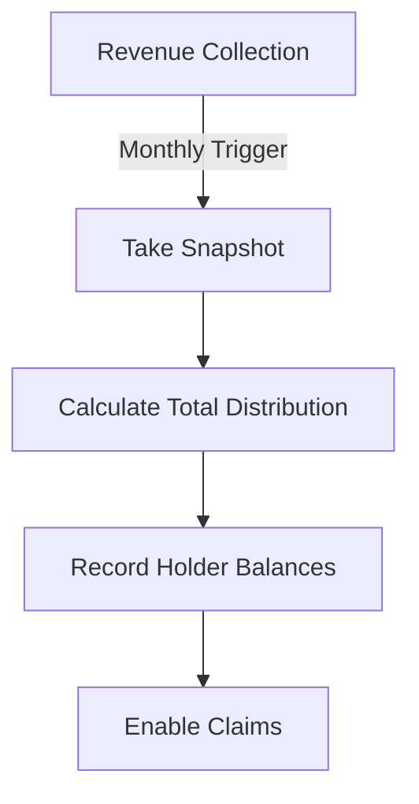

# Automated Dividend Distribution Protocol (ADDP)

The Automated Dividend Distribution Protocol (ADDP) is a Clarity smart contract designed for automated dividend distribution to token holders based on their holdings percentage and protocol revenue. This implementation is specifically designed for real estate tokenization, allowing property developers to distribute rental income and other revenue streams to token holders automatically and transparently.

## Features
- 🔄 Automated dividend distribution system
- 📊 Revenue tracking mechanism
- 📸 Automated snapshot system
- ⚖️ Proportional distribution calculation
- 💰 Claims-based withdrawal system
- 🛡️ Anti-gaming mechanisms
- ⏸️ Emergency pause functionality

## Technical Specifications
- Token Name: MetroSpace Property Token
- Token Symbol: MSPT
- Total Supply: 50,000,000 tokens
- Minimum Holding Period: 7 days
- Large Transfer Threshold: 1% of total supply (50,000 tokens)

## Contract Functions

### Administrative Functions
```clarity
(initialize-protocol)
(pause-protocol)
(unpause-protocol)
(take-snapshot)
```

### User Functions
```clarity
(transfer (amount uint) (sender principal) (recipient principal))
(deposit-revenue)
(claim-dividends (snapshot-id uint))
```

### Read-Only Functions
```clarity
(get-balance (holder principal))
(get-unclaimed-dividends (holder principal) (snapshot-id uint))
(get-current-snapshot-id)
(get-treasury-balance)
(is-protocol-paused)
```

## Security Features

### Anti-Gaming Mechanisms
1. **Minimum Holding Period**
   - 7-day minimum holding period before dividend eligibility
   - Prevents dividend farming through quick trades

2. **Large Transfer Detection**
   - Transfers exceeding 1% of total supply trigger special handling
   - Additional holding period verification for large transfers

3. **Snapshot Protection**
   - Only one snapshot can be in progress at a time
   - Prevents manipulation of dividend calculations

### Emergency Controls
- Emergency pause functionality for critical situations
- Only contract owner can pause/unpause
- Affects transfers and dividend claims

## Dividend Distribution Process

### 1. Revenue Collection
- Revenue is automatically tracked in the treasury
- Supports multiple revenue streams (rental income, fees, etc.)
- Transactions are recorded on-chain

### 2. Snapshot Mechanism


### 3. Claims Process
- Token holders can claim dividends for each snapshot
- Claims require minimum holding period verification
- One-time claim per snapshot per holder
- Automatic transfer upon successful claim

## Error Codes
- ERR-NOT-AUTHORIZED (u100): Unauthorized operation attempt
- ERR-INVALID-AMOUNT (u101): Invalid transfer or claim amount
- ERR-SNAPSHOT-IN-PROGRESS (u102): Snapshot already in progress
- ERR-NO-DIVIDENDS (u103): No dividends available for claim
- ERR-PAUSED (u104): Contract is paused

## Setup Instructions

### Prerequisites
- Clarity development environment
- STX wallet for contract deployment
- Basic understanding of Stacks blockchain

### Deployment Steps
1. Deploy the contract to the Stacks blockchain
2. Call `initialize-protocol` as contract owner
3. Configure initial token distribution
4. Verify contract state using read-only functions

### Integration Guide
```clarity
;; Example: Depositing Revenue
(contract-call? .addp deposit-revenue)

;; Example: Claiming Dividends
(contract-call? .addp claim-dividends u1)
```

## Testing Guide

### Key Test Scenarios
1. Token Transfer Functionality
   - Basic transfers
   - Large transfer handling
   - Invalid transfer attempts

2. Dividend Distribution
   - Revenue deposit
   - Snapshot creation
   - Dividend calculation
   - Claims processing

3. Security Features
   - Holding period enforcement
   - Pause/unpause functionality
   - Authorization checks

### Test Commands
```bash
# Run all tests
clarinet test

# Test specific functionality
clarinet test tests/addp_test.clar
```

## Best Practices for Integration

### Revenue Deposit
- Schedule regular deposits
- Monitor transaction success
- Keep transaction records

### Dividend Claims
- Verify eligibility before claiming
- Monitor gas costs
- Implement proper error handling

### Security Considerations
- Regular balance verification
- Monitoring for unusual activity
- Emergency response plan